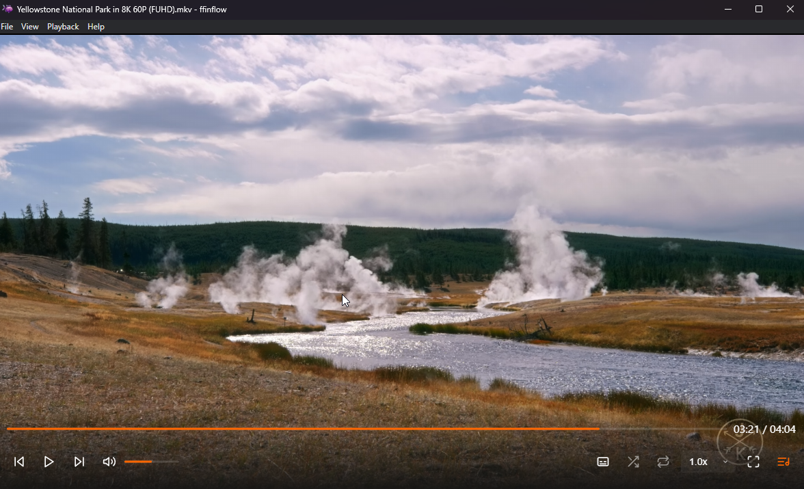

<div align="center">
  
  <br/>
  
</div>

# ffinflow

ffinflow is a minimalist Electron media player that uses Chromium for playback and FFmpeg/FFprobe for media probing, audio conversion, and embedded subtitle extraction.

The app is currently focused on Windows packaging. The checked-in runtime expects `ffmpeg.exe` and `ffprobe.exe` under `ffmpeg-binaries/` during development, and under Electron's packaged `resources/ffmpeg-binaries/` directory after a build.

## What It Does

- Opens local media files and folders into a playlist.
- Remembers playback position, volume, theme, subtitle settings, and other preferences with `electron-store`.
- Uses `music-metadata` for non-blocking media metadata and cover art extraction.
- Uses `fluent-ffmpeg` with FFmpeg/FFprobe for stream probing, unsupported audio conversion, and subtitle extraction.
- Supports external subtitles such as `.srt`, `.vtt`, `.ass`, `.ssa`, `.sub`, `.ttml`, and `.dfxp`.
- Can extract embedded subtitles into a temp cache for playback.
- Enables Chromium hardware acceleration switches when the saved setting is enabled.

## Project Shape

| File | Purpose |
| :--- | :--- |
| `main.js` | Electron main process, app lifecycle, FFmpeg path setup, file-open routing, media probing, and audio conversion. |
| `renderer.js` | Player UI orchestration, playlist state, playback controls, metadata display, and settings wiring. |
| `subtitles.js` | Subtitle discovery, embedded subtitle extraction, subtitle cache/state, and subtitle timing controls. |
| `copyFFmpeg.js` | Copies binaries from `ffmpeg-static` and `ffprobe-static` into `ffmpeg-binaries/` after install. |
| `package.json` | npm scripts, Electron Builder config, dependency list, and packaged extra resources. |
| `src/` | Smaller UI, playback, filesystem, fullscreen, theme, hardware acceleration, and utility modules. |

## FFmpeg Binaries

The current setup already downloads prebuilt FFmpeg and FFprobe binaries through npm:

- `ffmpeg-static`
- `ffprobe-static`

After `npm install`, the `postinstall` script runs:

```bash
node copyFFmpeg.js
```

That script copies the downloaded binaries into:

```text
ffmpeg-binaries/
```

Electron Builder then packages that directory through `build.extraResources`, so the installed app can load the binaries from:

```text
resources/ffmpeg-binaries/
```

### Can We Compile FFmpeg Ourselves?

Yes, but it is usually only worth doing if we need custom codec flags, a smaller binary, reproducible release artifacts, or control over licensing options.

For normal app development, the simplest and most reliable path is to keep using `ffmpeg-static` and `ffprobe-static`. That gives us known working binaries and keeps setup to `npm install`.

If we do compile our own binaries, the app does not need major code changes. The output just needs to match this layout:

```text
ffmpeg-binaries/
  ffmpeg.exe
  ffprobe.exe
```

Then run:

```bash
npm run build
```

The build will include those files in the packaged app.

### Recommended Binary Workflow

Use one of these workflows:

1. Default development workflow:

```bash
npm install
npm start
```

2. Build packaged Windows app:

```bash
npm install
npm run build
```

3. Use custom-built FFmpeg:

```bash
npm install
# Replace ffmpeg-binaries/ffmpeg.exe and ffmpeg-binaries/ffprobe.exe with custom builds.
npm run build
```

### Git LFS

The Windows FFmpeg binaries are larger than GitHub's normal 100 MB file limit, so this repo tracks them with Git LFS.

The LFS rule lives in `.gitattributes`:

```text
ffmpeg-binaries/*.exe filter=lfs diff=lfs merge=lfs -text
```

After replacing either binary, stage it normally:

```bash
git add ffmpeg-binaries/ffmpeg.exe ffmpeg-binaries/ffprobe.exe
```

Git will store small pointer files in the commit and upload the real executables through LFS during `git push`.

## Development

Install dependencies:

```bash
npm install
```

Start the app:

```bash
npm start
```

Build the installer:

```bash
npm run build
```

Publish through Electron Builder:

```bash
npm run publish
```

## Notes

- `main.js` currently resolves FFmpeg as `ffmpeg.exe`, so the packaged build is Windows-oriented.
- `subtitles.js` has cross-platform extension logic for packaged binaries, but the main process path is Windows-specific today.
- If cross-platform packaging becomes a goal, the FFmpeg path resolution in `main.js` should be updated to use the same platform-aware extension logic as `subtitles.js`.
- The repository currently keeps `ffmpeg-binaries/` available locally so development and packaging can run without relying on a global FFmpeg install.

## License

See [LICENSE](LICENSE).
